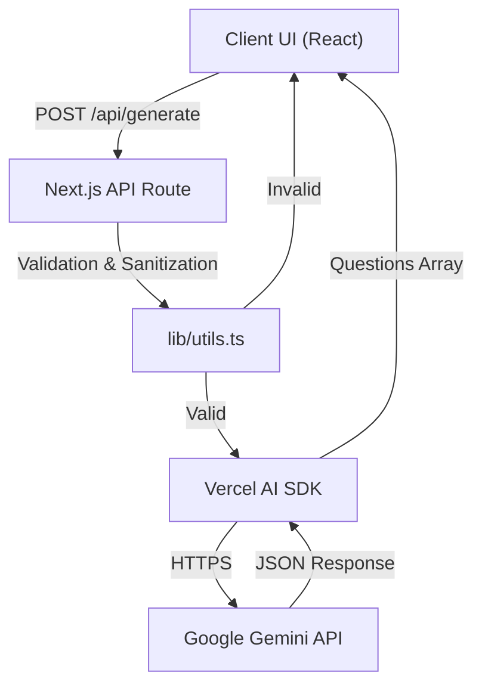

# Architecture

This document describes the high-level architecture and design decisions for the Interview Question Generator application.

## Overview

The application is built on Next.js using the App Router. It leverages Google Gemini's large language models to generate tailored interview questions based on a user-provided job title.

## Core Components

1.  **Frontend (`app/page.tsx`, `components/`)**:
    *   **`InterviewForm.tsx`**: Handles user input, client-side state, character limits, and loading indicators.
    *   **`QuestionList.tsx`**: Displays the generated questions and provides a "Copy to Clipboard" utility.
2.  **Backend Route (`app/api/generate/route.ts`)**:
    *   A secure, server-side API handler that accepts the job title, validates it, and communicates with the Gemini API.
3.  **Core Libraries (`lib/`, `types/`)**:
    *   **`lib/constants.ts`**: Contains all magic strings, configuration settings, and the AI System Prompt.
    *   **`lib/utils.ts`**: Contains input validation and sanitization logic to keep the API route lean and testable.
    *   **`types/index.ts`**: Holds shared TypeScript interfaces to ensure strong typing between the client and server.

## Design Decisions

### Security: API Key Isolation
The `GEMINI_API_KEY` is strictly confined to the server environment. The client only communicates with our own `/api/generate` endpoint, ensuring that the API key is never exposed to the browser.

### Structured Output Generation
We use the Vercel AI SDK's structured output capabilities (`Output.array`) coupled with `zod`. Instead of parsing unstructured text using regular expressions, the AI is instructed to return a strictly typed JSON array. This drastically improves the application's reliability and prevents parsing errors.

### Prompt Injection Resistance
User input is treated strictly as data ("Job title"). The system prompt defines the instructions and rules in a separate context from the user input, which acts as the primary defense against prompt injection attacks.

### Centralized Configuration
By moving the System Prompt, UI limits, and error messages to `lib/constants.ts`, the application becomes much easier to maintain, test, and scale without having to hunt for magic strings across various components.
